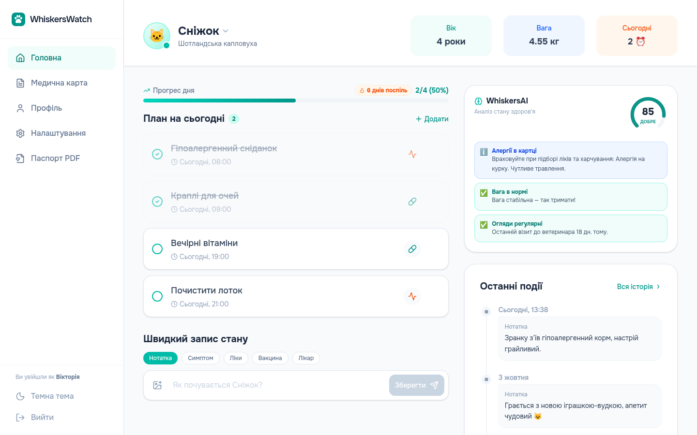
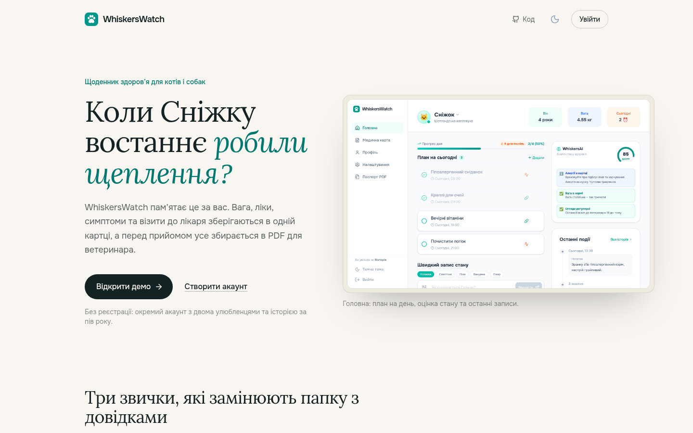
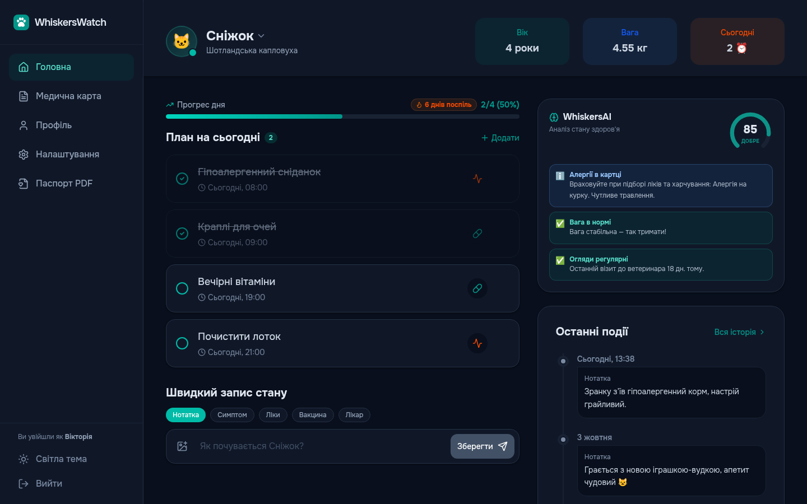
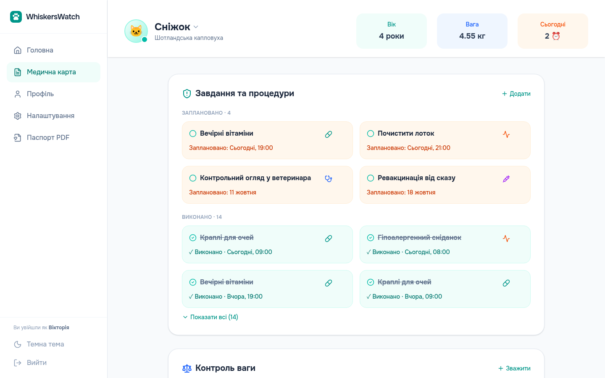
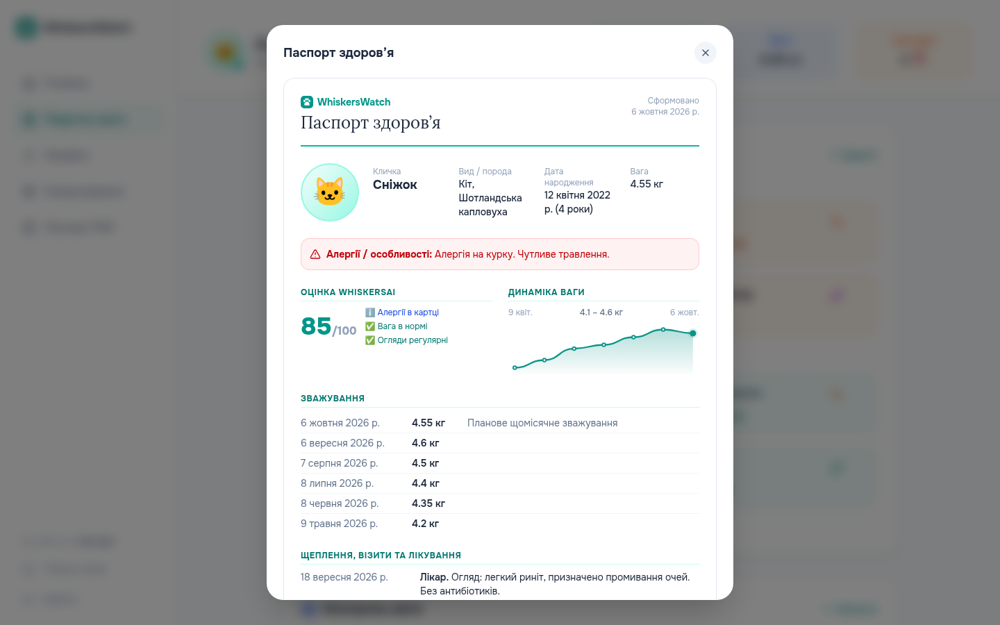
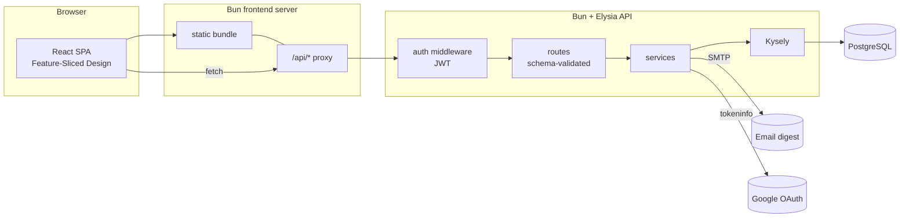

# 🐾 WhiskersWatch

**A full-stack pet health tracker:** medical records, weight trends, care reminders and a rule-based health score for every pet, in one responsive web app.

<!-- After deploying, put the live link here, e.g.: **Live demo → https://whiskers-watch.onrender.com** -->



> **Try it in one click.** The landing page has an **«Відкрити демо»** button. It creates a private sandbox account with two pets and six months of history, so you can click around without registering. Each visitor gets their own copy, and sandboxes are deleted after 24 hours.

---

## Features

| | |
|---|---|
| 🧠 **WhiskersAI health score** | A 0–100 score with prioritised insights, based on symptoms in recent notes, weight dynamics, overdue tasks, vet-visit recency, vaccinations, allergies and age. It is a transparent rule engine running on the client. |
| 📈 **Weight tracking** | An SVG chart with no chart library, change indicators and warnings about sudden weight loss. |
| ✅ **Daily care plan** | Today's tasks plus overdue ones, a progress bar, a 🔥 streak of fully completed days and confetti when you finish the day. |
| 🩺 **Medical history** | A timeline of notes, symptoms, medications, vaccines and vet visits with photos. Filtering and full-text search run on the server. |
| 📄 **Health passport (PDF)** | A one-page summary for the vet (allergies, weights, vaccinations, recent symptoms, upcoming procedures), saved through the browser's print-to-PDF. |
| 🔔 **Notifications** | Browser push reminders for upcoming tasks and a weekly HTML email digest over SMTP. |
| 🌗 **Dark mode** | Follows the OS setting and remembers a manual choice, with no flash of the wrong theme on load. |
| 🔐 **Auth** | Email and password (bcrypt plus a hand-rolled HS256 JWT) and Google Sign-In. |
| 📱 **Responsive** | Sidebar layout on desktop. On mobile: bottom navigation and bottom-sheet modals. |

<table>
  <tr>
    <td></td>
    <td></td>
  </tr>
  <tr>
    <td></td>
    <td></td>
  </tr>
</table>

## Tech stack

**Frontend:** React 19, TypeScript (strict), Tailwind CSS v4, lucide-react, bundled and served by Bun<br />
**Backend:** Bun, Elysia (typed routes with schema validation), Kysely (type-safe SQL), PostgreSQL<br />
**Tooling:** `bun test` (unit + API integration tests), GitHub Actions CI (typecheck → migrate → test → build → Docker image)<br />
**Deploy:** a single Docker image (the API also serves the built frontend), with the database on Neon and hosting on Render

## Architecture



- **Backend layers:** `routes` (HTTP + validation) → `services` (business logic) → `db` (Kysely, typed schema). Every query that touches a pet, task or record checks ownership, so users can never reach each other's data.
- **Frontend layers:** `api` (typed API client) → `context` + `hooks` (state and actions) → `features` (UI units) → `pages` (composition only). See [frontend/README.md](frontend/README.md).

## Engineering notes

- **Upload hardening.** The file extension is derived from the validated MIME type, never from the client's filename. Elysia also checks the file's magic bytes. Files are served with `nosniff` and a sandbox CSP, which closes a stored-XSS path (`evil.html` uploaded as `image/png`).
- **Sandboxed demo accounts.** `POST /api/auth/demo` creates a flagged user and fills it with data dated relative to "now", so the demo never looks stale. Expired sandboxes are purged with a cascade delete.
- **Theming without `dark:` everywhere.** Tailwind v4 exposes the palette as CSS variables. Dark mode remaps them (the slate scale is inverted, tints become translucent), so the components contain no theme logic at all.
- **Timezone correctness.** Date inputs use local time instead of `toISOString()` (UTC), and `DATE` columns are parsed as local calendar days. Tests run in several time zones.
- **Optimistic UI.** Task checkboxes flip instantly and roll back if the request fails. Quick pet switching can't show stale data from a slower response.
- **Safe email HTML.** Every user-provided value in the digest is escaped.
- **Single-service deploy.** In production the API process serves the fingerprinted frontend bundle: assets are cached forever, everything else falls back to `index.html`, and path traversal is blocked. One origin means no CORS and no proxy.
- **Images in Postgres.** Free hosts wipe the disk on every restart, so uploads are stored in a `bytea` table linked to the user and deleted with the account (expired demo sandboxes included).
- **Rate limiting.** Login is limited per IP + email, and registration and demo creation per IP.
- **Self-hosted fonts.** Onest and Lora (with Cyrillic) are registered through the `FontFace` API, so the `.woff2` files ship as separate cacheable assets.

## Getting started

Requirements: [Bun](https://bun.sh) ≥ 1.3 and PostgreSQL.

```bash
# 1. Backend
cd backend
cp .env.example .env          # set DATABASE_URL and JWT_SECRET
bun install
bun run migrate               # create tables (idempotent)
bun run seed                  # optional: demo@whiskers.app / demo1234
bun run dev                   # → http://localhost:3001

# 2. Frontend (in another terminal)
cd frontend
bun install
bun run dev                   # → http://localhost:3000 (proxies /api to :3001)
```

## Deployment

Free setup: **Neon** (PostgreSQL) + **Render** (Docker web service from `render.yaml`).
Step-by-step guide (in Russian): [docs/DEPLOY.md](docs/DEPLOY.md).

```bash
# What the Docker image does, runnable locally:
cd frontend && bun run build
cd ../backend && STATIC_DIR=../frontend/dist bun run migrate && STATIC_DIR=../frontend/dist bun index.ts
```

## Tests

```bash
cd frontend && bun test                                    # date/plural helpers, streaks, health engine
cd backend  && bun test                                    # JWT, upload sanitising, HTML escaping
cd backend  && API_URL=http://localhost:3001 bun test      # + API integration tests against a running server
```

## Project structure

```
Dockerfile          production image: builds the frontend, runs the API
render.yaml         Render blueprint (free web service)
backend/
  index.ts          app entry
  src/routes/       HTTP layer: one Elysia plugin per entity
  src/services/     business logic (auth, demo sandbox, digest, uploads…)
  src/schemas/      request validation (TypeBox)
  src/middlewares/  auth, error handling, static site
  src/db/           Kysely connection, table types, scripts/ (migrate, seed, drop)
  tests/            unit + API integration tests
frontend/
  src/main.tsx      browser entry; src/dev-server.ts is the dev server with /api proxy
  src/api/          typed API client per entity
  src/context/      Auth / Pet / Nav state
  src/pages/        Landing, Home, Medical, Profile, Settings
  src/features/     home, medical, passport, pets, profile, settings, auth
  src/shared/       UI kit (Modal, Logo, PetAvatar, ThemeToggle…) and pure helpers
  tests/            unit tests
```
